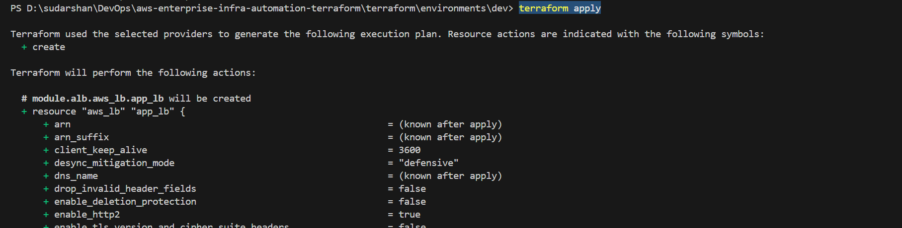
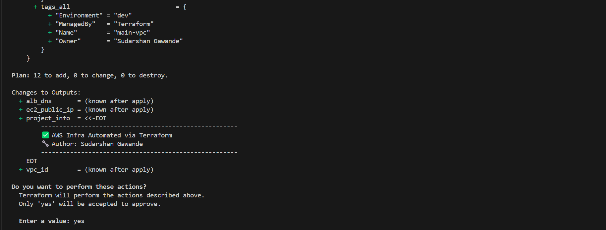
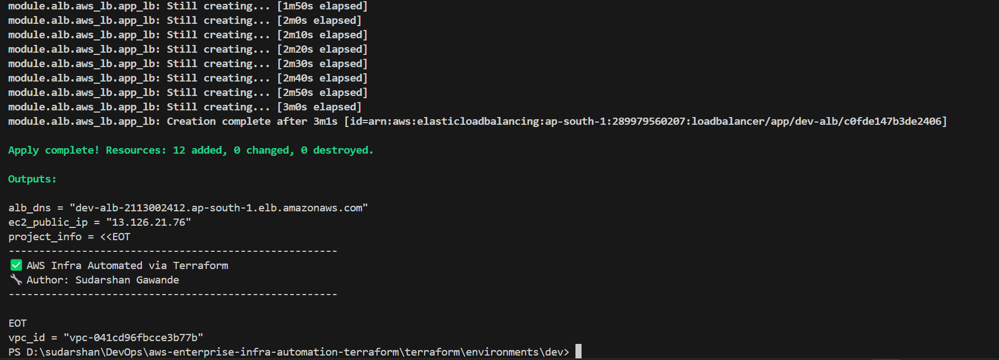
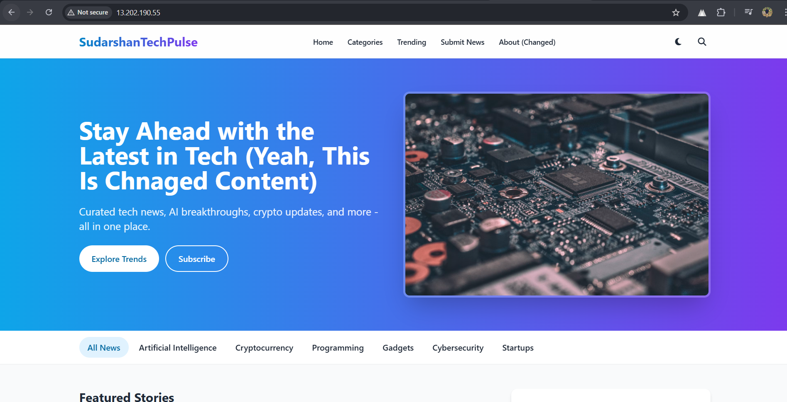
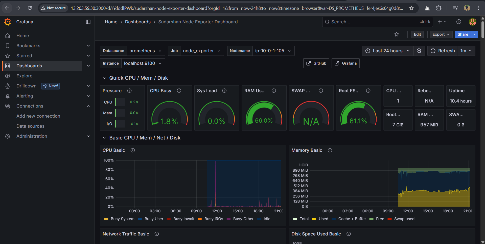
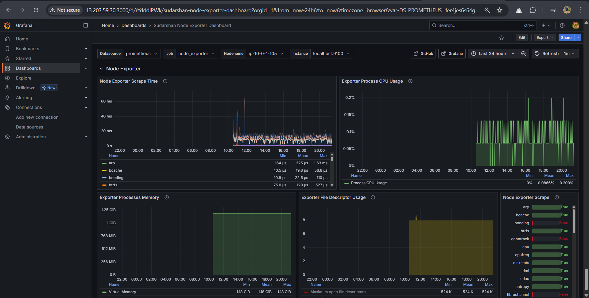
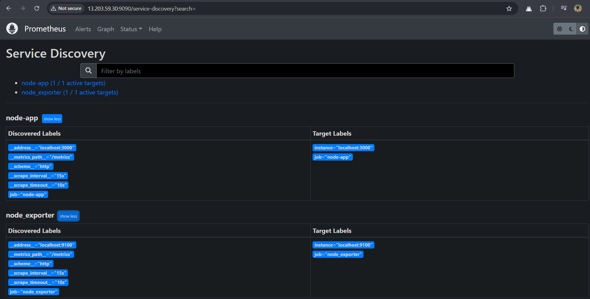
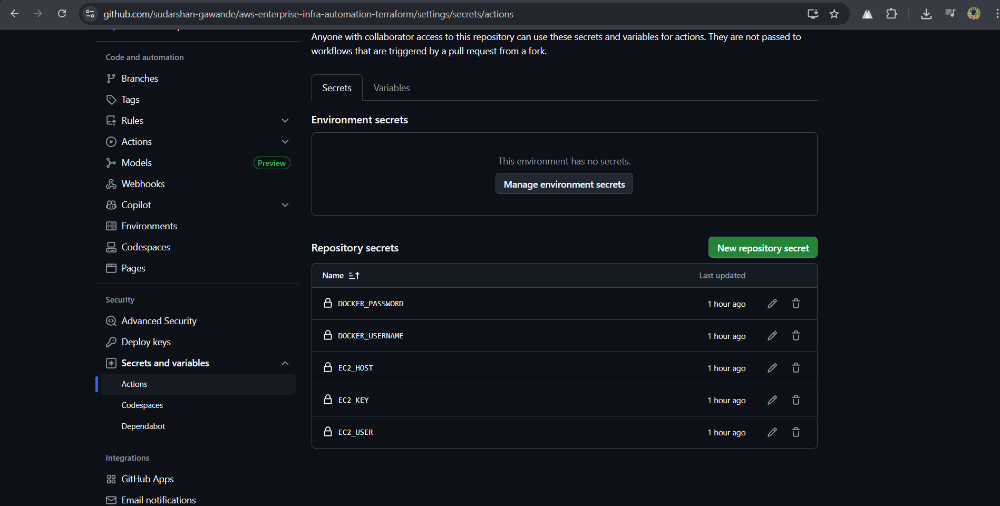

# 🚀 AWS Enterprise Infrastructure Automation with Terraform

<div align="center">


[](https://github.com/sudarshan-gawande/aws-enterprise-infra-automation-terraform/actions/workflows/build-and-push.yml)
[](https://github.com/sudarshan-gawande/aws-enterprise-infra-automation-terraform/actions/workflows/deploy-to-ec2.yml)

<br/>

**Production-Ready Infrastructure-as-Code (IaC) solution using Terraform, AWS, Docker, GitHub Actions, and Grafana**  
*Automated. Scalable. Observable. Secure.*

</div>

---

## 🏗️ Production-Ready DevOps Infrastructure

An **enterprise-grade cloud-native automation setup** featuring:

- ✅ Modular Terraform infrastructure for AWS
- ✅ CI/CD pipelines via GitHub Actions
- ✅ Dockerized Node.js microservice
- ✅ End-to-end monitoring with Prometheus & Grafana

🔗 [🔥 Live Demo](http://13.203.59.30) • [📖 Documentation](#-table-of-contents) • [🛠️ Quick Start](#-quick-start) • [💼 Portfolio](https://sudarshangawande.com)

---


## 📋 Table of Contents

- [🎯 Project Overview](#-project-overview)
- [🏗️ Architecture](#-architecture)
- [🧰 Technology Stack](#-technology-stack)
- [✨ Key Features](#-key-features)
- [🚀 Quick Start](#-quick-start)
- [📁 Project Structure](#-project-structure)
- [🔄 CI/CD Pipeline](#-cicd-pipeline)
- [💡 Implementation Highlights](#-implementation-highlights)
- [🛠️ Challenges & Solutions](#-challenges--solutions)
- [📈 Monitoring & Observability](#-monitoring--observability)
- [🔮 Future Roadmap](#-future-roadmap)
- [👨‍💻 Author](#-author)
- [📄 License](#-license)

---


## 🎯 Project Overview

**aws-enterprise-infra-automation-terraform** is a complete, production-ready infrastructure automation project that provisions, deploys, and manages a containerized Node.js application on AWS using modern DevOps and Infrastructure-as-Code (IaC) practices.

It integrates end-to-end automation using **Terraform, GitHub Actions, Docker**, and **AWS cloud services**, making it ideal for scalable enterprise deployments.

### 💎 What Makes This Project Stand Out?

- 🔄 **End-to-End Automation** – From code push to deployment without manual intervention  
- 🏗️ **Modular Terraform Design** – Clean, reusable modules for each infrastructure component  
- 🛡️ **Security Best Practices** – IAM roles, security groups, secrets management, SSH hardening  
- 📊 **Observability & Reliability** – ALB, health checks, Prometheus + Grafana monitoring  
- 💰 **Cost Optimization** – Efficient resource provisioning, AWS Free Tier utilization  
---

## 🏗️ Architecture

<div align="center">
  
</div>

---

## 🧰 Technology Stack

<div align="center">

| **Category**              | **Technologies**                                                  |
|---------------------------|--------------------------------------------------------------------|
| ☁️ **Cloud Platform**     | AWS (EC2, VPC, ALB, IAM, Route 53)                                |
| 🏗️ **Infrastructure as Code** | Terraform (Modular Architecture)                             |
| 🐳 **Containerization**    | Docker, DockerHub Registry                                       |
| 🔄 **CI/CD Pipeline**      | GitHub Actions, Jenkins, Automated Workflows                     |
| 🌐 **Application**         | Node.js, Express.js, RESTful APIs                                |
| 🔒 **Security**            | IAM Roles, Security Groups, SSH Keys                             |
| 📊 **Monitoring**          | Prometheus, Grafana, AWS CloudWatch                              |
| 🔐 **Secrets Management**  | GitHub Secrets, AWS Secrets Manager                              |

</div>

---

## ✨ Key Features

### 🎯 Infrastructure Automation
- 🧩 **Modular Terraform Design**: Separate modules for VPC, EC2, ALB, IAM, etc.
- 🌍 **Multi-Environment Support**: Dev, staging, and production setups
- 🔄 **State Management**: S3 backend with DynamoDB locking

### 🚀 CI/CD Deployment Pipeline
- ⚡ **Automated Builds**: Triggered on push to `main` branch
- 🐳 **Container Registry**: Auto-push to DockerHub
- 📡 **Remote EC2 Deployment**: Via secure SSH
- 🔍 **Health Monitoring**: App-level health checks and uptime validation

### 🛡️ Security & Best Practices
- 🔐 **Secrets Management**: GitHub Secrets & AWS Secrets Manager
- 🌐 **Network Security**: Custom VPC with public/private subnets
- 🚪 **Access Control**: IAM roles with least privilege principles
- 🔒 **SSH Hardening**: Key-based secure authentication

---


## 🚀 Quick Start

### 🧰 Prerequisites
```bash
# Required CLI tools (must be pre-installed)
aws --version          # AWS CLI
terraform --version    # Terraform >= 1.0
docker --version       # Docker
git --version          # Git
```

### 1️⃣ Clone & Setup
```bash
# Clone your repository and navigate to the development environment
git clone https://github.com/sudarshan-gawande/aws-enterprise-infra-automation-terraform.git
cd aws-enterprise-infra-automation-terraform/terraform/env/dev
```

### 2️⃣ Configure AWS Credentials & Terraform Init
```bash
# Configure AWS credentials (ensure IAM user has required permissions)
aws configure
# Enter AWS Access Key ID, Secret Access Key, region (e.g., ap-south-1), and output format (e.g., json)

# Initialize Terraform and provision infra
terraform init
terraform plan
terraform apply -auto-approve
```

### 3️⃣ Deploy Application (via GitHub Actions)
```bash
# From root directory of the project
git add .
git commit -m "feat: deploy application"
git push origin main
# GitHub Actions will build the Docker image, push to DockerHub, and deploy to EC2 via SSH
```

---

## 📁 Project Structure

```
📦 aws-enterprise-infra-automation-terraform/
├── 🏗️ terraform/
│   ├── 🌍 env/
│   │   └── dev/
│   │       ├── main.tf              # Main configuration for dev
│   │       ├── variables.tf         # Input variables
│   │       ├── outputs.tf           # Output values
│   │       └── terraform.tfvars     # Environment-specific variables
│   └── 📚 modules/
│       ├── vpc/                     # VPC module
│       ├── ec2/                     # EC2 module
│       ├── alb/                     # Application Load Balancer module
│       └── iam/                     # IAM roles and policies
├── 🐳 app/
│   ├── src/                         # Application source code
│   ├── Dockerfile.dev               # Dockerfile for development
│   ├── Dockerfile.prod              # Dockerfile for production
│   ├── package.json                 # Node.js dependencies
│   └── healthcheck.js               # App health check endpoint
├── 🔄 .github/
│   └── workflows/
│       ├── build-and-push.yml       # CI pipeline: Docker build & push
│       └── deploy-to-ec2.yml        # CD pipeline: SSH deployment to EC2
├── 📊 monitoring/                   # Prometheus + Grafana configurations
├── 🔒 secrets/                      # Secret templates (do not store real secrets)
└── 📖 docs/                         # Project documentation and architecture

```

---

## ⚙️ Terraform Execution & Output

This project provisions infrastructure using **Terraform's modular architecture**, showcasing reusable, production-ready configurations for AWS resources like **VPC**, **EC2**, and **ALB**.

> 📦 Output Modules: `vpc_id`, `ec2_public_ip`, `alb_dns` — rendered automatically post `terraform apply`.

### 📜 Execution Snapshot

  
*Detailed plan displaying infrastructure to be created via Terraform*

  
*Summary using `project_info` output — ideal for audits*

  
*Captured final values: EC2 IP, VPC ID, and ALB DNS — immediately usable post-deploy*

---


## 🔄 CI/CD Pipeline

### Workflow Overview In Short (Not Complete Script)
```yaml
name: Build and Deploy to AWS EC2 

on:
  push:
    branches: [ main ]
  pull_request:
    branches: [ main ]

jobs:
  build-and-deploy:
    runs-on: ubuntu-latest
    steps:
      - name: 📥 Checkout Code
      - name: 🐳 Build Docker Image
      - name: 📤 Push to DockerHub
      - name: 🚀 Deploy to EC2
```

### Pipeline Stages

| **Stage** | **Action** | **Status** |
|-----------|------------|------------|
| 🔍 **Code Analysis** | Lint and security scan | ✅ Active |
| 🏗️ **Build** | Docker image creation | ✅ Active |
| 🧪 **Test** | Unit and integration tests | ✅ Active |
| 📤 **Publish** | Push to DockerHub registry | ✅ Active |
| 🚀 **Deploy** | SSH deployment to EC2 | ✅ Active |
| ✅ **Verify** | Health check validation | ✅ Active |

---

## 💡 Implementation Highlights

### 🏗️ Modular Terraform Architecture
```hcl
# Example: VPC Module Usage
module "vpc" {
  source = "../../modules/vpc"
  
  vpc_cidr             = var.vpc_cidr
  availability_zones   = var.availability_zones
  public_subnet_cidrs  = var.public_subnet_cidrs
  
  tags = local.common_tags
}
```

### 🐳 Optimized Docker Configuration
```dockerfile
# Multi-stage build for production
FROM node:18-alpine AS builder
WORKDIR /app
COPY package*.json ./
RUN npm ci --only=production && npm cache clean --force

FROM node:18-alpine AS runtime
WORKDIR /app
COPY --from=builder /app/node_modules ./node_modules
COPY . .
EXPOSE 3000
CMD ["node", "index.js"]
```

### 🔄 Automated Deployment Script
```bash
#!/bin/bash
# Deployed via GitHub Actions
docker pull elonerajeev/infra-app:latest
docker stop app-container || true
docker run -d --name app-container -p 80:3000 elonerajeev/infra-app:latest
```

---

## 🎯 Challenges & Solutions

<details>
<summary><strong>🔧 Infrastructure Challenges</strong></summary>

| **Challenge** | **Solution** | **Impact** |
|---------------|--------------|------------|
| VPC Module Dependencies | Implemented proper output references | ✅ Resolved |
| ALB Subnet Requirements | Configured multi-AZ public subnets | ⚡ Performance |
| State File Conflicts | S3 backend with DynamoDB locking | 🔒 Consistency |
| Security Group Rules | Least privilege access principles | 🛡️ Security |

</details>

<details>
<summary><strong>🚀 Deployment Challenges</strong></summary>

| **Challenge** | **Solution** | **Impact** |
|---------------|--------------|------------|
| SSH Key Management | GitHub Secrets integration | 🔐 Security |
| Docker Registry Auth | Automated token refresh | 🔄 Reliability |
| Zero-Downtime Deployment | Blue-green deployment strategy | ⚡ Availability |
| Container Health Checks | Custom health endpoint | 📊 Monitoring |

</details>

---

## 🖥️ Deployed Application



## 📈 Grafana Dashboard

This project integrates **Grafana + Prometheus** to monitor EC2 system metrics using the official **Node Exporter Full Dashboard (ID: 1860)**.

> 🔍 Dashboard Link: [Node Exporter Full - Grafana ID 1860](https://grafana.com/grafana/dashboards/1860-node-exporter-full/)

### 🖥️ Dashboard Preview


*Real-time insights into EC2 instance performance*


*Comprehensive view of system metrics via Node Exporter*


## 📊 Prometheus Metrics




## 🔐 GitHub Secrets Configuration

To enable secure and automated deployment using GitHub Actions, configure the following **repository-level secrets**:

### 🔑 Required Secrets

| Secret Name       | Purpose                                                |
|-------------------|--------------------------------------------------------|
| `DOCKER_USERNAME` | DockerHub username to push Docker images              |
| `DOCKER_PASSWORD` | DockerHub personal access token or password           |
| `EC2_HOST`        | Public DNS/IP of your target EC2 instance             |
| `EC2_USER`        | SSH login user (e.g., `ubuntu`, `ec2-user`)           |
| `EC2_KEY`         | Base64 encoded private key for connecting to EC2 over SSH |

> 🔒 **Security Best Practice**: Never commit secrets or credentials to the repository. Always use [GitHub Secrets](https://docs.github.com/en/actions/security-guides/encrypted-secrets) for sensitive data.

---

### 🛠️ How to Add Secrets

1. Go to your GitHub repository
2. Navigate to **Settings → Secrets and variables → Actions**
3. Click on `New repository secret`
4. Add each required secret as shown in the table above

📷 Example Screenshot:

> 

---


# Application Metrics
GET /metrics
Response: Prometheus-formatted metrics


### Planned Monitoring Stack
- **📊 Prometheus**: Metrics collection and alerting
- **📈 Grafana**: Visualization dashboards
- **🔍 AWS CloudWatch**: Infrastructure monitoring
- **📱 Slack Integration**: Alert notifications


## 👨‍💻 Author : Sudarshan Gawande

<div align="center">


**Sudarshan Gawande**  
*DevOps Engineer | Cloud Enthusiast | Automation Specialist*

[](https://sudarshangawande.com)
[](https://www.linkedin.com/in/sudarshan-gawande/)
[](https://github.com/sudarshan-gawande)
[](mailto:sudarshangawande99@gmail.com)

> *"Crafting secure, scalable, and automated infrastructure with passion and precision."*

---

## 🏆 GitHub Achievements

<p align="center">
  
</p>

---

## 📊 GitHub Stats & Contributions

<p align="center">
  
  
</p>
<p align="center">
  
</p>

</div>

---

## 📄 License

This project is licensed under the **MIT License** – see the [LICENSE](LICENSE) file for details.

---

## 🌟 Support

If you found this project helpful, please consider giving it a ⭐!

**Made with ❤️ and ☕ by Sudarshan Gawande**

---

💬 **Let's collaborate on DevOps & Cloud-based projects! 🚀**
